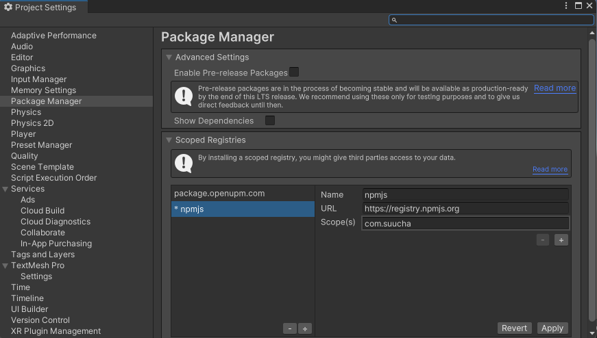
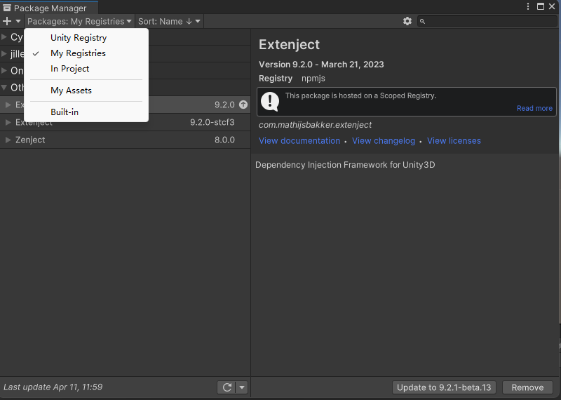

# Suucha Application Development Kit for Unity (Suucha ADKU)
## 目标
我们的产品旨在帮助游戏开发者快速构建应用程序，从而节省开发者的时间和精力。我们提供一个基础功能套件，这样开发者可以专注于自己游戏的业务需求而不必担心基础功能的实现。我们的目标是提高应用程序的开发效率，同时保持高质量的代码和可靠性。我们致力于成为游戏开发者最好的朋友，为他们提供优秀的开发工具和技术支持。

## 设计思路
Suucha ADKU抽象了一些组件API，实现了一些基本逻辑，第三方服务只需要实现Suucha ADKU定义的组件接口，就可以方便地提供给开发者使用。

目前版本主要提供两个组件的抽象设计：

1. 事件埋点
2. 广告播放

并且已经提供针对AppsFlyer、Google Firebase Analytics、Max等第三方服务的实现。

Suucha ADKU通过IOC容器实现依赖注入来解耦第三方服务，因为抽象出了API，使用者不用关心具体服务由哪个第三方提供，只需要在IOC中注册你想使用的第三方服务，而不需要修改具体使用服务的代码，可以做到无缝切换第三方服务。

## 接入Suucha ADKU
Suucha ADKU包使用UPM管理，包存储在npmjs的官方仓库里。
### 首先设置Package Manager仓库
#### 方法一：
从菜单Edit -> Project Settings 打开Project Settings窗口，然后在左边导航到Package Manager:

点击Scoped Registries下的加号增加npmjs仓库：
* 在Name中填入：npmjs
* 在URL中填入：https://registry.npmjs.org
* 点击Scope(s)下的加号，新增一行填入：com.suucha
  
#### 方法二：
打开项目文件夹Packages下的manifest.json文件，增加scopedRegistries，并且增加一个npmjs的仓库，添加com.suucha的scope。
如果之前已经存在npmjs的仓库，直接增加一个com.suucha的scope就可以了
``` json
"scopedRegistries": [
    {
      "name": "npmjs",
      "url": "https://registry.npmjs.org",
      "scopes": [
        "com.suucha"
      ]
    }
  ]
```
### 引入Suucha ADKU包
#### 方法一
从菜单Window中选择Package Manager，打开Package Manager窗口，Packages选择My Registries：

然后在搜索框里面输入Suucha，找到需要引入的包，然后点击右下角的安装。

#### 方法二
打开项目文件夹Packages下的manifest.json文件，在dependencies下增加：
``` json
"dependencies": {
    "com.suucha.unity.core": "1.0.0",

```
> 一般来说，我们并不会单独接入Suucha Unity Core，而是直接接入第三方服务如埋点，广告等依赖Suucha Unity Core的组件，比如接入：Suucha Unity AppsFlyer、Suucha Unity Google Analytics、Suucha Unity Max等。

## 开始
在项目中引入了Suucha ADKU后，实现一个接口IAfterSuuchaInit，这个类的Execute方法会在Suucha ADKU初始化完成后调用，一般我们在这个方法类执行一些配置工作，比如：设置日志等级、启用广告组件、添加并启用第三方埋点服务。
``` csharp
public class AfterSuuchaInit : SuuchaBase, IAfterSuuchaInit
{
    public void Execute()
    {
        //设置日志等级
        Suucha.App.SetLogLevel(LogLevel.Debug); 
        //添加一个事件计数的事件拦截器
        Suucha.App.AddLogEventIntercept(new EventCounterIntercept(new System.Collections.Generic.List<EventCounterConfiguration>
        {
            new EventCounterConfiguration()
            {
                Name="test",
                CountList = new System.Collections.Generic.List<int> { 1, 2,3,5,10 }
            },
            new EventCounterConfiguration()
            {
                Name="click",
                CountList = new System.Collections.Generic.List<int> { 1, 2,3,5,10 }
            }
        }));
        //添加app运行时长的事件参数拦截器
        Suucha.App.AddLogEventParameterIntercept(new AppRunDurationEventParameterIntercept());
        //添加事件计数的事件参数拦截器
        Suucha.App.AddLogEventParameterIntercept(new EventCountParameterIntercept(UnityEngine.Application.persistentDataPath));
        //初始化AppsFlyer
        Suucha.App.InitAppsFlyer("your appsflyer devId");
        //初始化并启用AppsFlyer事件上报器并允许事件计数拦截器
        Suucha.App.InitAppsFlyerReporter().EnableEventCounter().Use();
        //初始化firebase、firebase analytics事件上报器并启用
        Suucha.App.InitFirebase().InitFirebaseAnalyticsReporter().Use();
        //启用Max广告平台
        Suucha.App.UseMax();
    }
}
```
Suucha ADKU提供了两个基类，一个是纯C#的SuuchaBase，一个是继承自MonoBehaviour的SuuchaMonoBehaviourBase，这两个类目前提供了日志输出和本地存储
建议所有的游戏脚本继承自这两个类之一
### 日志输出
Suucha基类提供了日志输出类Logger的实例，可以直接使用，如下：
``` csharp
public class Script1 : SuuchaBase
{
  public void Method1()
  {
    //可以直接使用Logger来记录日志
    Logger.Debug("Log test");
  }
}
```
日志输出的格式如下：第一个[]中为日志等级，第二个[]中为类名其后就是日志内容。
``` csharp
Logger.Debug("Log debug");
//输出为：[DEBUG] [Script1] Log debug
Logger.Error("Log error");
//输出为：[ERROR] [Script1] Log error
```
> 目前默认的日志输出使用Unity Debug来实现的，当然你也可以用第三方的日志输出来实现，在初始化时注册到IOC容器中。
### 资产管理
Suucha ADKU提供了一个本地的简单的资产管理接口，用户的金币、卡片等都是属于用户资产，资产建议使用顶级长编码来识别
``` csharp
//增加资产
Suucha.App.AddAsset("0101", 100);
//减少资产
Suucha.App.SubAsset("0101", 50);
//获取资产
var value = await Suucha.App.GetAsset("0101");
```
### 上报埋点事件
具体参见：[埋点](Documentation/logEvent.md)

### 广告播放
具体参见：[广告播放](Documentation/adplaying.md)